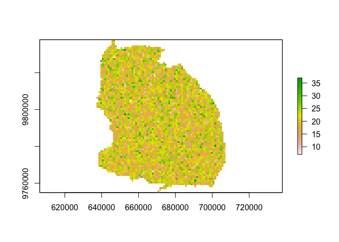
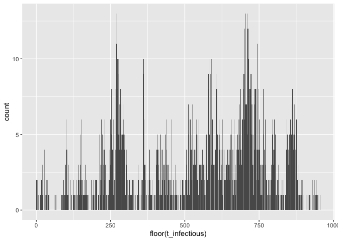
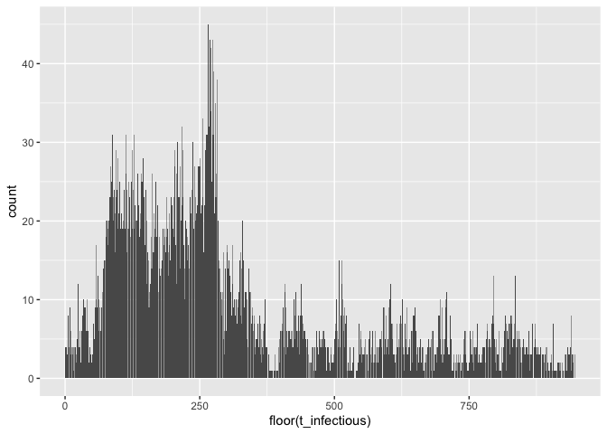
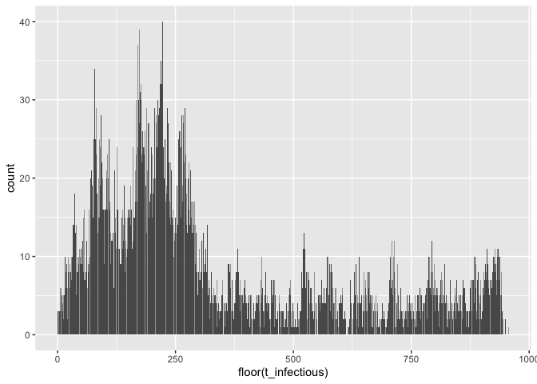
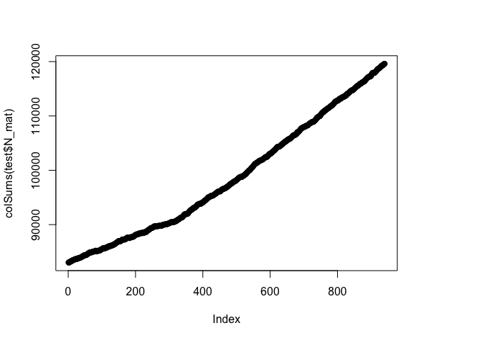

<!-- README.md is generated from README.Rmd. Please edit that file -->

# simrabid

`simrabid` is an implementation of a spatially explicit,
individual-based model of canine rabies. It is very much a work in
progress!

## Installation

And the development version from [GitHub](https://github.com/) with:

``` r
# install.packages("devtools")
devtools::install_github("mrajeev08/simrabid")

# To install suggested packages & dependencies:
devtools::install_github("mrajeev08/simrabid", dependencies = TRUE)
```

## Minimum Working Example

This is a basic example which shows you the very basics:

``` r
library(raster)
#> Loading required package: sp
library(data.table)
#> 
#> Attaching package: 'data.table'
#> The following object is masked from 'package:raster':
#> 
#>     shift
library(sf)
#> Linking to GEOS 3.8.1, GDAL 3.1.4, PROJ 6.3.1
library(tidyr)
#> 
#> Attaching package: 'tidyr'
#> The following object is masked from 'package:raster':
#> 
#>     extract
library(dplyr)
#> 
#> Attaching package: 'dplyr'
#> The following objects are masked from 'package:data.table':
#> 
#>     between, first, last
#> The following objects are masked from 'package:raster':
#> 
#>     intersect, select, union
#> The following objects are masked from 'package:stats':
#> 
#>     filter, lag
#> The following objects are masked from 'package:base':
#> 
#>     intersect, setdiff, setequal, union
library(magrittr)
#> 
#> Attaching package: 'magrittr'
#> The following object is masked from 'package:tidyr':
#> 
#>     extract
#> The following object is masked from 'package:raster':
#> 
#>     extract
library(simrabid)
library(ggplot2)

# Use the example serengeti shapefile in the package
sd_shapefile <- st_read(system.file("extdata/sd_shapefile.shp", 
                                    package = "simrabid"))
#> Reading layer `sd_shapefile' from data source `/Library/Frameworks/R.framework/Versions/4.0/Resources/library/simrabid/extdata/sd_shapefile.shp' using driver `ESRI Shapefile'
#> Simple feature collection with 75 features and 12 fields
#> geometry type:  POLYGON
#> dimension:      XY
#> bbox:           xmin: 637186.6 ymin: 9754400 xmax: 707441.9 ymax: 9837887
#> projected CRS:  WGS 84 / UTM zone 36S

# 1. set up the space at 1000m res
sd_shapefile$id_col <- 1:nrow(sd_shapefile)
out <- setup_space(shapefile = sd_shapefile, resolution = 1000, id_col = "id_col", 
                   use_fasterize = TRUE)
#> Loading required package: fasterize
#> 
#> Attaching package: 'fasterize'
#> The following object is masked from 'package:graphics':
#> 
#>     plot
#> The following object is masked from 'package:base':
#> 
#>     plot

# Fake some pop data here
pop_out <- out
values(pop_out) <- rpois(ncell(pop_out), 20)
pop_out[is.na(out)] <- NA
plot(pop_out)
```



``` r
# 2. set-up simulation framework (timesteps + demography)
start_up <- setup_sim(start_date = "2002-01-01",
                      apprx_end_date = "2020-01-01", 
                      days_in_step = 7, 
                      rast = out, 
                      death_rate_annual = 0.48, 
                      birth_rate_annual = 0.52,
                      waning_rate_annual = 1/3,
                      params = list(start_pop = pop_out[]), 
                      by_admin = FALSE)

# Set up vaccination
vacc_dt <- simrabid::sim_campaigns(locs = 1:75, campaign_prob = 0.9, 
                                   coverage = 0.7, sim_years = 20, 
                                   burn_in_years = 5,
                                   steps_in_year = 52)
vacc_dt_none <- vacc_dt[0]

# Without vax
system.time({
  test <- simrabid(start_up, start_vacc = 0.2, I_seeds = 3,
                 vacc_dt = vacc_dt_none,
                 params = c(list(R0 = 1.1, k = 1, iota = 0.25),
                            param_defaults),
                 days_in_step = 7,
                 observe_fun = beta_detect_monthly,
                 serial_fun = serial_lognorm,
                 dispersal_fun = dispersal_lognorm,
                 secondary_fun = nbinom_constrained,
                 incursion_fun = sim_incursions_pois,
                 movement_fun = sim_movement_continuous,
                 sequential = FALSE, allow_invalid = TRUE,
                 leave_bounds = TRUE, max_tries = 100,
                 summary_fun = return_env,
                 track = FALSE,
                 weights = NULL,
                 row_probs = NULL,
                 coverage = TRUE,
                 break_threshold = 0.8, 
                 by_admin = FALSE) 
}
)
#>    user  system elapsed 
#>   6.234   0.750   7.788

ggplot(test$I_dt) + geom_bar(aes(x = floor(t_infectious)))
```



``` r
plot(colSums(test$N_mat))
```



``` r
formals(use_mget)$names <- c("I_dt", "N_mat")
system.time({
  test <- simrabid(start_up, start_vacc = 0.2, I_seeds = 3,
                 vacc_dt = vacc_dt,
                 params = c(list(R0 = 1.2, k = 1, iota = 1),
                            param_defaults),
                 days_in_step = 7,
                 observe_fun = beta_detect_monthly,
                 serial_fun = serial_lognorm,
                 dispersal_fun = steps_weibull,
                 secondary_fun = nbinom_constrained,
                 incursion_fun = sim_incursions_pois,
                 movement_fun = sim_movement_continuous,
                 sequential = TRUE, allow_invalid = TRUE,
                 leave_bounds = TRUE, max_tries = 100,
                 summary_fun = use_mget,
                 track = TRUE,
                 weights = NULL,
                 row_probs = NULL,
                 coverage = TRUE,
                 break_threshold = 0.8, 
                 by_admin = FALSE) 
}
)
#>    user  system elapsed 
#>  13.100   1.973  17.153

# With vax
ggplot(test$I_dt) + geom_bar(aes(x = floor(t_infectious)))
```



``` r
plot(colSums(test$N_mat))
```



`simrabid` is written to be modular, feel free to poke around the
function documentation to see the options–technical vignettes coming
soon!

## Roadmap

-   A relative probability based movement model (i.e. movement
    probability is relative to index location, for instance if you want
    to account for landscape barriers (roads, rivers, etc.)); see old
    commit code for how this might work with a probability list;

-   Use non utm coordinate space, instead use cellFromXY in raster and
    haversine distances to get location of cell id movements so that you
    can simulate across larger spatial scales; one issue is then your
    scale of aggregation gets distorted, aggregate grid cells somehow so
    it’s approximately 1 km?

-   Implement carrying capacity on pop growth, and replacement of dogs
    removed due to infection.

-   Implement colonization of uninhabited patches (with some limits so
    households can’t pop up in space that is uninhabitable,
    i.e. rivers/roads/etc.)

-   Build a constructor class that gets passed to simrabid function so
    that only **valid** combinations of model arguments can be passed,
    and you only have to test this once for N simulations.

-   Profile and speed up!

    -   Vaccination function
    -   Filtering data.table
    -   Only track currently infectious + exposed linelist
    -   Easy fixes (i.e. storing things in the appropriate type, keys
        onf filters, etc.)

-   Issue with intermediate scales where small admin units do not get
    matched to any grid cell

-   Village metapopulation (separate function?)

-   Example output environment for customizing summary functions

-   Applying mortality to exposed class?

-   Documentation on how to use & customize

-   Construct synthetic populations or use high res pop data to get
    estimates of spatial dog pops (popcompr?)

-   Benchmarks across scales, etc.

## Bug fixes

-   Issue with setup\_space, id col has to be numeric

## Known limitations / potential extensions

-   Doesn’t simulate expansion of occupied cells (i.e. colonization of
    patches by doggos)
-   Carrying capacity for growth
